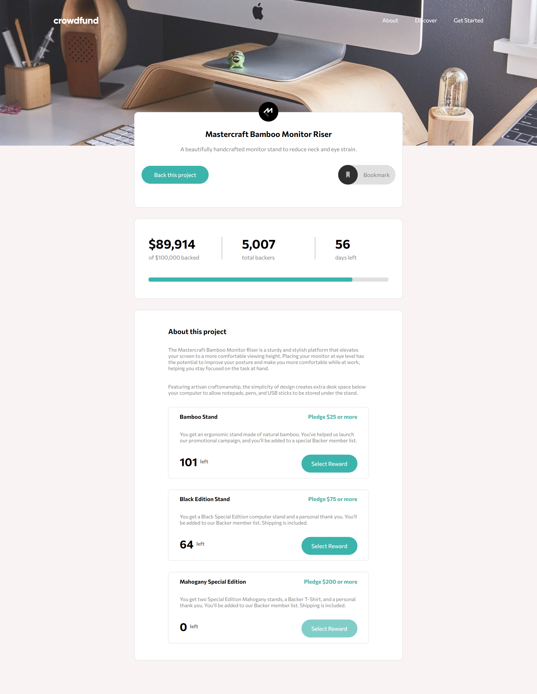
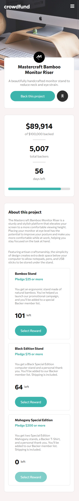

# Frontend Mentor - Crowdfunding product page solution

This is a solution to the [Crowdfunding product page challenge on Frontend Mentor](https://www.frontendmentor.io/challenges/crowdfunding-product-page-7uvcZe7ZR). Frontend Mentor challenges help you improve your coding skills by building realistic projects.

## Table of contents

- [The challenge](#the-challenge)
- [Screenshot](#screenshot)
- [Links](#links)
- [Built with](#built-with)
- [Author](#author)

## The challenge

Users should be able to:

- View the optimal layout for the site depending on their device's screen size

## Screenshot

### Links

- Solution URL: (https://github.com/tarikdincer/Crowd-Funding-Product-Page)
- Live Site URL: (https://tarikdincer.github.io/Crowd-Funding-Product-Page/)

## Built with

- Semantic HTML5 markup
- CSS custom properties
- Flexbox
- Grid
- Mobile-first workflow
- Vanilla JS
- DOM Manipulation

## Author

- Frontend Mentor - [@tarikdincer](https://www.frontendmentor.io/profile/tarikdincer)
